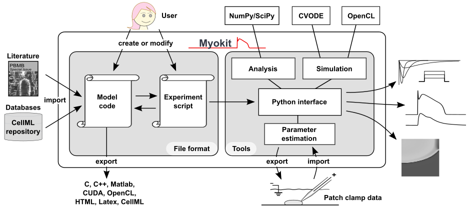

# Examples from the 2016 PBMB paper

Michael Clerx, Pieter Collins, Enno de Lange, and Paul G.A. Volders (2016).
_Myokit: A simple interface to cardiac cellular electrophysiology_.
Progress in Biophysics and Molecular Biology, Volume 120, issues 1-3, pages 100-114.
[10.1016/j.pbiomolbio.2015.12.008](https://doi.org/10.1016/j.pbiomolbio.2015.12.008).

This repository contains up-to-date example code, adapted from the files originally published with the paper cited above.

An updated version of the schematic describing Myokit is shown below.



## Example 1

The first example can be opened in the Myokit IDE (the Myokit "app") and contains a model, protocol, and script: [example-1a-ide.mmt](https://raw.githubusercontent.com/myokit/pbmb-2016/main/example-1a-ide.mmt).
To use it, download the file by right clicking the link above and selecting "Save link as", then open it in the IDE.

When writing scripts _inside an mmt file_, like in the example above, you can access the model and protocol parts with:
```
m = get_model()
p = get_protocol()
```

In many cases it's better to write a script separately from the `mmt` file (for example to re-use the exact same model in multiple simulations).
To access an `mmt` file's model and protocol externally, use:
```
m = myokit.load_model('my-model.mmt')
p = myokit.load_protocol('my-protocol.mmt')
```
or
```
m, p, _ = myokit.load('my-model.mmt')
```
if both are in the same file (this also loads the script part as `_`).

A version of example 1 that loads the model and protocol externally is given in the jupyter notebook [example-1b-notebook.ipynb](https://raw.githubusercontent.com/myokit/pbmb-2016/main/example-1b-notebook.ipynb).
You can download this and [the required model file](https://raw.githubusercontent.com/myokit/models/main/c/tentusscher-2006.mmt) to try offline, or you can view the example [in your browser](example-1b-notebook.ipynb).

## Example 2

The [second example](example-2-transmural-differences.ipynb), follows up from example 1b, and shows how to change a model variable in a simulation.


